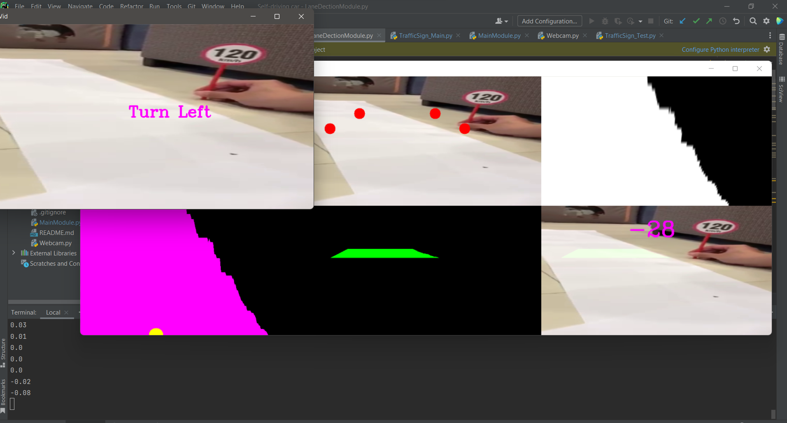
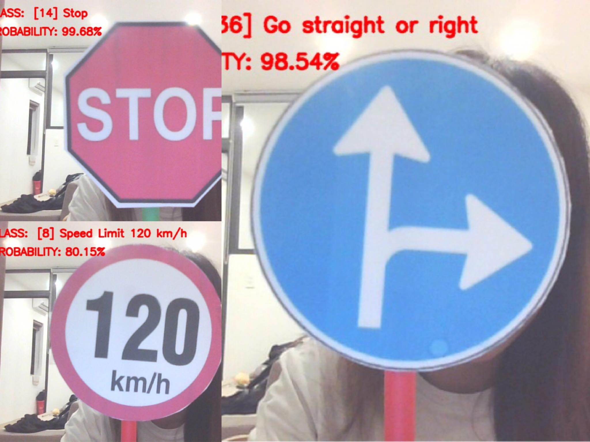

# Self-Driving Car Project

Based on Lane Detection and Traffic Signs Recognition to build a self-driving car software

## Installing: 
To use the project, first clone the repo on your device using the command below: 
```conda
git init
```
```cd
git clone https://github.com/shayongithub/self-driving-car-ai/
```

Required package:
- tensorflow
- keras
- numpy
- matplotlib
- pandas
- opencv

These requirements can be easily installed by: `pip install -r requirement.txt`

## Architecture

### Lane Detection

Using the idea of **Pixel Summation** to find the lane curve and giving suggestion based on the curve values

<br>
<p align="center">
    
</p>
<br />

### Traffic Sign Recognition

Using Convolutional neural network (CNN) to classify images.

Please install library version below to create the model:
<ul>
    <li>keras 2.3.1</li>
    <li>tensorflow 2.0.0</li>
    <li>python 3.6</li>
</ul>

<br>
<p align="center">
    
</p>
<br />

## Demo

We currently seperate these two modules into two files: **LineDetection** and **TrafficSignDetection**. So, if you want to test the Line Detection module, first `cd LineDetection`, and then run the command `python LaneDetectionModule.py`. Simiarly, `cd TrafficSignDetection` and run `python TrafficSign_Test.py`. 

We record our own video as `test-video.mp4`, so if you want to try your own video, place the new video in the same folder and change the *line 74* on **LaneDetectionModule.py** and *line 14* on **TrafficSign_Test.py** with the name of your new video.

## References
[1] Murtaza's Workshop - Robotics and AI. [Self Driving Car with Lane Detection using Raspberry Pi](https://www.youtube.com/watch?v=aXqoPiMPhDw&list=PLMoSUbG1Q_r_wT0Ac7rOlhlwq9VsZDA0b)
